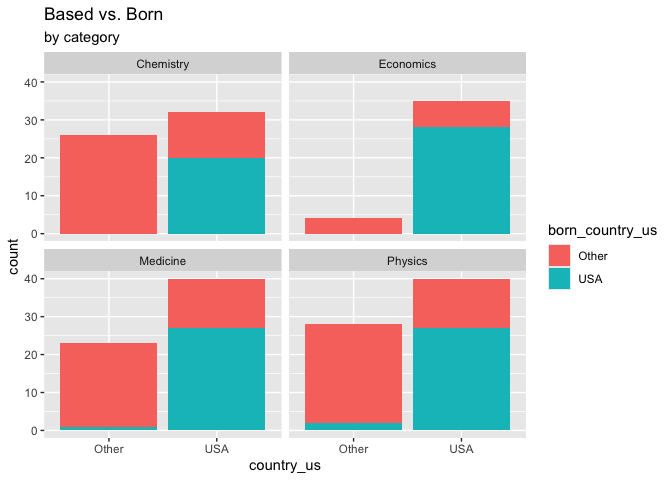

Lab 03 - Nobel laureates
================
Fiona Wang
2025-02-03

### Load packages and data

``` r
library(tidyverse) 
```

``` r
nobel <- read_csv("data/nobel.csv")
```

## Exercises

### Exercise 1

There are 935 rows in the dataset, meaning there are 935 observations in
total. There are 26 variables in the dataset. Each row gives the
information of one Nobel laureates, specifically, their names and
country of birth, death, and prize-winning.

### Exercise 2

``` r
nobel_living = nobel %>% 
  filter(!is.na(country) & gender != "org" & is.na(died_date))
```

This new data frame has 228 rows.

Next, we create a new variable: country_us.

``` r
nobel_living <- nobel_living %>% 
  mutate(
    country_us = if_else(country == "USA", "USA", "Other")
  )
```

We will limit our analysis to only Physics, Medicine, Chemistry, and
Economics.

``` r
nobel_living_science <- nobel_living %>% 
  filter(category %in% c("Physics", "Medicine", "Chemistry", "Economics"))
```

It’s interesting that we still have 228 observations.

### Exercise 3

``` r
nobel_living_science %>% 
  ggplot(mapping = aes(y = country_us, color=category, fill = category)) + 
  geom_bar() + facet_wrap(~category, nrow = 2) + 
  labs(title = "Born in the U.S vs. Others", subtitle = "by category")
```

<!-- -->

According to the visualization, I do observe that more Nobel laureate
were based in the U.S. when they won the Nobel prize for all four
categories. This is more true for Economics than other categories. I
would conclude that the visualization supports Buzzfeed headline, but I
can’t be sure whether the difference between the bars is significant.

### Exercise 4

``` r
nobel_living_science <- nobel_living_science %>% 
  mutate(
    born_country_us = if_else(born_country == "USA", "USA", "Other")
  )
nobel_living_science %>% 
  count(born_country_us)
```

    ## # A tibble: 2 × 2
    ##   born_country_us     n
    ##   <chr>           <int>
    ## 1 Other             123
    ## 2 USA               105

Of the 228 winners, there are 105 that were born in the U.S.

### Exercise 5

``` r
nobel_living_science %>% 
  ggplot(mapping = aes(x = country_us, fill = born_country_us)) + 
  geom_bar() + facet_wrap(~category, ncol = 2) + 
  labs(title = "Based vs. Born", subtitle = "by category")
```

<!-- -->

Of those US-based Nobel winners, many were born in other countries. This
statement is true, although I would say “some were born in other
countries”. There are actually more US born winners. We are looking at
the bars that say USA (on the right of each facet). There are more area
of blue (born in USA).

### Exercise 6

``` r
nobel_living_science %>% 
  filter(country_us == "USA" & born_country_us == "Other") %>% 
  count(born_country) %>% 
  arrange(desc(n))
```

    ## # A tibble: 21 × 2
    ##    born_country       n
    ##    <chr>          <int>
    ##  1 Germany            7
    ##  2 United Kingdom     7
    ##  3 China              5
    ##  4 Canada             4
    ##  5 Japan              3
    ##  6 Australia          2
    ##  7 Israel             2
    ##  8 Norway             2
    ##  9 Austria            1
    ## 10 Finland            1
    ## # ℹ 11 more rows

Germany and United Kingdom are the most common, each has 7 instances,
followed by China, 5 instances.
